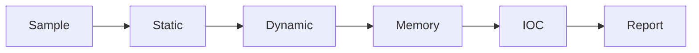

<!-- ================= HEADER ================= -->

<p align="center">
  
</p>

<p align="center">
  
</p>

<p align="center">
  
</p>

---

<!-- ================= ABOUT ================= -->

## 🧠 About Me

<table>
<tr>
<td width="60%">

```diff
+ DFIR & Malware Analysis Specialist
+ Reverse Engineer (Userland + Windows Internals)
+ Builder of high-performance forensic tools
```

* 🧬 I break systems to understand their internals
* 💀 I hunt malware and reconstruct attacker behavior
* ⚙️ I write efficient tooling in C / C++ / Python

</td>
<td align="center">
  
</td>
</tr>
</table>

---

<!-- ================= STACK ================= -->

## ⚡ Tech Stack

<p align="center">
  
</p>

<table>
<tr>
<td>

**Languages**

* C
* C++
* Python

</td>
<td>

**Domains**

* Malware Analysis
* DFIR
* Reverse Engineering
* Windows Internals

</td>
<td>

**Focus Areas**

* Memory Forensics
* Process Injection
* API Hooking
* Artifact Analysis

</td>
</tr>
</table>

---

<!-- ================= TOOLING ================= -->

## 🛠️ DFIR Tooling

<p align="center">
  
  
</p>

```bash
> init dfir_core
> enumerate_processes
> scan_memory_regions
> detect_injection_patterns
> extract_IOCs
> generate_report
```

**What I build:**

* 🧠 Memory scanners (entropy, RWX, shellcode detection)
* 🔍 Handle/Process analyzers (NtQuerySystemInformation)
* ⚡ Behavior engines (API tracing + heuristics)
* 🛡️ DFIR automation (artifact parsing + timelines)

---

<!-- ================= RESEARCH ================= -->

## 🧩 Active Research

<p align="center">
  
</p>

```ini
[ LIVE ANALYSIS ]
- Kernel-level visibility (bridging userland gaps)
- Memory forensics pipelines
- Anti-debug / anti-VM bypass
- Modern malware evasion
```

---

<!-- ================= WORKFLOW ================= -->

## 🔬 DFIR Workflow



---

<!-- ================= PROJECTS ================= -->

## 💻 Highlight Projects

<p align="center">
  
  
</p>

* 🧠 **Custom Memory Scanner** — region walker + entropy + RWX heuristics
* 🔍 **Handle Hijacking Detector** — cross-process handle tracing
* ⚡ **Malware Behavior Engine** — API hooks + anomaly scoring
* 🛡️ **DFIR Toolkit** — artifacts → timeline → report

---

<!-- ================= STATS ================= -->

## 📊 GitHub Stats

<p align="center">
  
  
  <br/>
  
</p>

---

<!-- ================= FOOTER ================= -->

## 🧠 Quote

> "Malware hides in noise. I extract the signal."

---

## ⚠️ Disclaimer

For **educational, defensive security, and DFIR purposes only**.

---

<p align="center">
  
</p>

<!-- =============== END =============== -->
